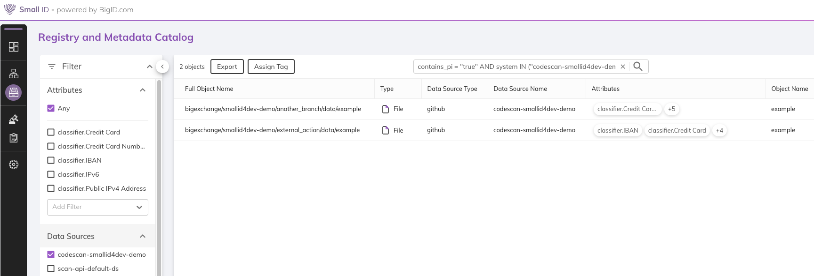

# About
A github action that will scan your repository via SmallID or BigID. It will create a new github datasource per repository and start a scan on each run.
After each scan, you'll be able to see the results in the catalog. Currently, it does not fail your action if there are findings.

# How to use
## Workflow example
You need to declare the following snippet in `.github/workflows/codescan.yml` (or any other filename in that directory)
```yaml
name: smallid 
on: [push]
jobs:
  codescan:
    runs-on: ubuntu-latest
    steps:
      - name: codescan 
        uses: bigexchange/codescan-bigid-action@v0
        with:
          domain: <YOUR SMALLID/BIGID DOMAIN NAME> 
          bigid_token: ${{ secrets.BIGID_TOKEN }}
          github_personnal_access_token: ${{ secrets.PA_TOKEN }}
```
# Setup
## Create & define secrets
### BigID/SmallID Token
Get a BigID (or smallID) token via Administration->Access Management. Select a user and generate a new token. Register this token in your github reposity (Settings->Secrets->Actions) as a new secret ("BIGID_TOKEN" in the example)

### Github Personnal Access token
Create a dedicated access token in github via https://github.com/settings/tokens with repo access (Full control of private repositories). Register this token in your github reposity (Settings->Secrets->Actions) as a new secret ("PA_TOKEN" in the example)

## Domain
Replace <YOUR SMALLID/BIGID DOMAIN NAME> by a FQDN like tenant.bigid.cloud

# See Results
Results will appear in the catalog. You will have multiple entries for the same file if multiple branches are in use.
One datasource is created per repository.


